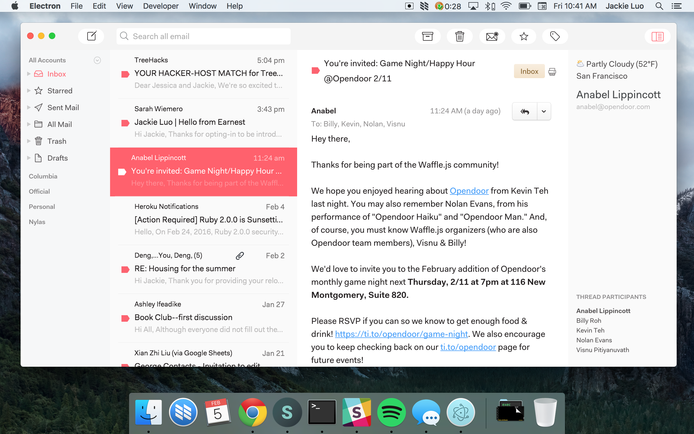

# Sunrise for N1
A sunrise theme for N1, inspired heavily by [Wattenberger](https://github.com/Wattenberger/Nylas-N1-theme).

## Installation
1. Download the [Nylas N1](https://nylas.com/n1) email client!
2. Download the [latest release](https://github.com/jackiehluo/n1-sunrise/releases) of Sunrise.
3. On the N1 menu, select `Nylas N1 > Install Theme...`.
4. Find the directory for this plugin to install it. :tada:
